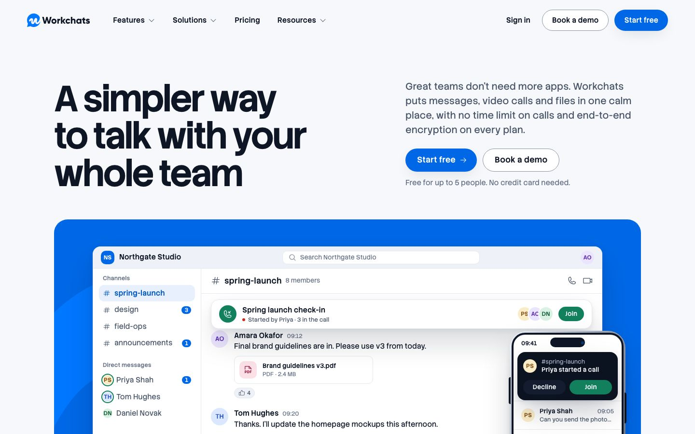
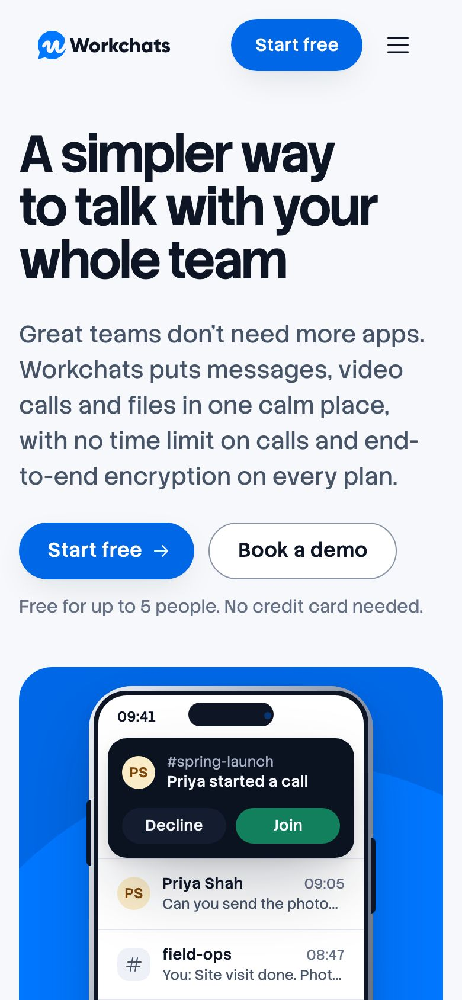
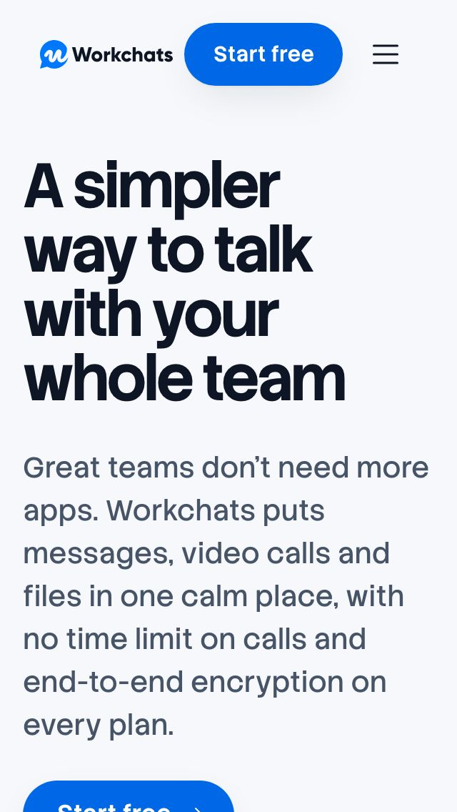

# Phase 0 — Audit of the current home page

**Status:** Phase 0 (audit) of phases 0–4, waiting for the checkpoint ("findings agreed").
**Audited build:** `main` at `3ac391c`, production build (`next build` + `next start`), 3 October 2026.
**Branch for the redesign:** `redesign/home-v2`.

The short version: the current page is well engineered and badly argued. It is accessible, static, fast
and honest, and almost none of that reaches a visitor who has five seconds. The page never says what
Workchats replaces until screen 6 on a desktop (screen 11 on a phone), hides the free plan in a 15px grey
footnote, sells nothing that can be installed, names five competitors, and builds four of its eight
sections from one card-grid recipe. The redesign keeps the engineering and replaces the argument.

---

## Working assumptions

A person is available, so this document stops at the checkpoint. These are the assumptions it makes:

1. **The live site is the source of facts, and contradictions go to the owner.** Where two live pages
   disagree (section 9), the audit records both and the strategy will use the weaker claim until the
   owner decides.
2. **The redesign skill is applied from its `SKILL.md`.** `/redesign-existing-projects` lives in
   `.agents/skills/`, which this Claude Code session doesn't register as an invocable skill, so its Scan →
   Diagnose checklist was followed by hand (section 6). Its Fix step is overridden by the brief (§4.3).
3. **Earlier owner feedback still stands unless this brief overrides it** (recorded in section 8.3), for
   example "no outline or highlight frame on pricing plans", which can coexist with the brief's
   "recommended plan marked by more than colour".
4. **The reference images stay out of git.** The repository is public, and the three images show
   third-party products and a commercial mockup. They are now in `.gitignore`; nothing in this audit
   depends on committing them.

---

## 1. Method

| What            | How                                                                                                                                                                                                                                                                                          |
| --------------- | -------------------------------------------------------------------------------------------------------------------------------------------------------------------------------------------------------------------------------------------------------------------------------------------- |
| Rendering       | Chromium (Playwright 1.63) against the production build. 1440 × 900 and 1024 × 768 at 1×; 390 × 844 and 320 × 568 at 2× with touch. The hero is captured about 9 s into its 14 s loop, when the call has started and rings on the phone.                                                     |
| Measurements    | A script records page length, the position of every section and of each business-case fact (in screens from the top), CTA labels and counts, inert controls and competitor names in the HTML and visible text. Raw data: [`audit/before/measurements.json`](audit/before/measurements.json). |
| Redesign skill  | The skill's audit list, category by category, against the code and the screenshots (section 6).                                                                                                                                                                                              |
| Conversion      | Clarity, value proposition, CTA hierarchy, friction, trust and the monetisation path, scored against the funnel in the brief (§2).                                                                                                                                                           |
| Facts           | Twelve live pages fetched on 3 October 2026 (home, features ×4, pricing, FAQ, download, about, terms, privacy, the five-tools blog post), read for facts only. The sign-up, store and installer links were requested to see where they land.                                                 |
| Baseline checks | `typecheck`, `lint`, 57 unit tests, `check:tokens`, `build` and `check:bundle` pass. `format:check` failed only on files added after the last commit (the skills, the brief); `.prettierignore` now covers them.                                                                             |

---

## 2. Screenshots

| Width | First viewport                                                  | Whole page                                  |
| ----- | --------------------------------------------------------------- | ------------------------------------------- |
| 1440  | [1440-first-viewport.jpg](audit/before/1440-first-viewport.jpg) | [1440-full.jpg](audit/before/1440-full.jpg) |
| 1024  | [1024-first-viewport.jpg](audit/before/1024-first-viewport.jpg) | [1024-full.jpg](audit/before/1024-full.jpg) |
| 390   | [390-first-viewport.jpg](audit/before/390-first-viewport.jpg)   | [390-full.jpg](audit/before/390-full.jpg)   |
| 320   | [320-first-viewport.jpg](audit/before/320-first-viewport.jpg)   | [320-full.jpg](audit/before/320-full.jpg)   |

 

---

## 3. The page in numbers

Positions are in screens from the top of the page (1.0 = one viewport height). The brief asks for the
business case inside the first two screens on desktop.

| Measure                                      | 1440                     | 1024 | 390   | 320                        |
| -------------------------------------------- | ------------------------ | ---- | ----- | -------------------------- |
| Page length                                  | 9.5                      | 11.4 | 19.1  | **31.4**                   |
| "Start free" in the hero                     | 0.34                     | 0.44 | 0.52  | 0.96 (cut off by the fold) |
| "Free for up to 5 people" (the main hook)    | 0.41, 15px grey footnote | 0.52 | 0.59  | 1.17 (second screen)       |
| Downloads bar                                | 1.22                     | 1.51 | 1.39  | 2.39                       |
| Data residency (region chips)                | 4.70                     | 5.66 | 9.43  | 15.60                      |
| Encryption                                   | 5.22                     | 6.24 | 10.00 | 16.56                      |
| What it replaces ("One app instead of five") | 5.69                     | 6.81 | 11.45 | 18.96                      |
| What it costs (Pro £3)                       | 7.00                     | 8.30 | 14.34 | 23.86                      |
| Reliability (99.9% uptime SLA)               | 7.50                     | 8.99 | 14.79 | 24.61                      |

| Measure                                | Result                                                                                                                                |
| -------------------------------------- | ------------------------------------------------------------------------------------------------------------------------------------- |
| Competitor names in visible text       | Slack ×3, Google Workspace ×3, Zoom ×2, Loom ×2, WhatsApp ×2 (13, 11, 5, 5 and 5 in the HTML, JSON-LD included)                       |
| Controls that do nothing               | 6 (every platform button)                                                                                                             |
| Working download links on the page     | 0 (the only route to `/download` is the Resources menu and the footer)                                                                |
| "Start free" / "Book a demo"           | 5 / 4 on desktop (Start free: header, hero, calculator, Free plan, final band; Book a demo: header, hero, security strip, final band) |
| Links to unreleased features in `main` | 3 ("Coming soon" cards)                                                                                                               |
| DOM elements                           | 991 of 1,000                                                                                                                          |
| First-load JavaScript                  | 117.8 KB Brotli of 120 KB (6 files; `HeaderNav` is the only client component)                                                         |
| First view, total                      | 210 KB of 800 KB                                                                                                                      |
| Lighthouse (README, 1 Oct 2026)        | Performance 97–99 mobile, 100 desktop; LCP 1.6–1.7 s mobile (applied), 0.6 s desktop; CLS 0                                           |

**Verdict on the numbers.** The page is technically within every budget, but the budgets that matter for
the rebuild are nearly spent: 9 DOM elements and 2.2 KB of first-load JS are left. The business case
(cost, SLA, security, residency) sits between screens 4.7 and 7.5 on desktop and between 9.4 and 24.6 on
phones. None of it is inside the first two screens at any width.

---

## 4. The five-second read

What a first-time visitor can take from the first screen, before scrolling:

| Question the visitor has      | What the first screen answers                                                                                                                                     |
| ----------------------------- | ----------------------------------------------------------------------------------------------------------------------------------------------------------------- |
| What is it?                   | Partly. The headline says "talk", which could be a phone system or a messenger. The lead names messages, calls and files; the product window confirms a chat app. |
| Who is it for?                | "Your whole team". No size, sector or region, although the facts exist (teams of 10 to 500 in the UK, EU and Middle East).                                        |
| Why not what we use today?    | "Great teams don't need more apps" hints at consolidation, without saying what it consolidates or what that saves.                                                |
| What does it cost?            | "Free for up to 5 people" in the smallest, greyest text on the screen. No paid price.                                                                             |
| Can I trust it with our data? | "End-to-end encryption on every plan", inside the lead paragraph.                                                                                                 |
| What do I do next?            | Two equal buttons ("Start free", "Book a demo"). Nothing to install, although installing is the first business goal.                                              |

At 320 px the first screen holds the headline and the lead paragraph only: the hero button sits on the
fold and the free plan is on screen two.

This is a heuristic read. The brief's five-second test with three people outside the project belongs in
Phase 4, on the new page.

---

## 5. Conversion audit

The funnel the page should make obvious: **land → understand in 5 seconds → try free (up to 5, no card, no
clock) → install on every device → grow past 5 or need more → Pro.**

### 5.1 Clarity

- **The headline names a feeling, not a category.** "A simpler way to talk with your whole team" is the
  live site's line and it is pleasant, but "talk" doesn't tell a buyer whether this replaces their chat
  app, their meeting tool or their phone system. The lead paragraph does the explaining, in the 20px grey
  text people skim.
- **The story the hero demo tells is the right one** (a message turns into a call that rings on a
  teammate's phone) but it plays small, fast and once every 14 seconds, inside a window that reads as a
  screenshot. The cross-device point never gets stated in words.
- **Four sections share one recipe** (features, bento, security, pricing): a 52px headline, a grey intro,
  then a grid of rounded cards. Nothing signals which section matters most, so the page reads as a list of
  equally important things.
- **Section headlines are slogans.** "Everything your team needs. Nothing they don't.", "Built for teams who
  actually talk", "Questions? We're glad you asked." None carries information a buyer could repeat.

### 5.2 Value proposition

- **"What it replaces" arrives on screen 5.7** (desktop) and names five competitor products to do it, which
  the brief rules out (§3.2) and which exposes the page to a fair-comparison challenge (section 9.3).
- **The free plan is the strongest offer and the quietest element.** It appears five times on the page (hero
  footnote, pricing intro, Free card, FAQ, final band), never with what a 5-person team actually gets, never
  with "it doesn't expire", and never with what happens when person number six joins.
- **The "calm by design" details** (working hours, connection requests, offline, multi-company, no 90-day
  archive) are what make Workchats feel considered, and they sit in a bento grid on screen 3, written as
  equal tiles beside "no time limit on calls".
- **No single number carries the pitch.** The calculator's saving (£15,744 a year for 50 people) is the most
  persuasive figure on the page and it is on screen 6, in the one dark section, behind a slider.

### 5.3 CTA hierarchy

- **One question, asked nine times.** "Start free" ×5 and "Book a demo" ×4 on desktop, three times as the
  same pair with the same weight, regardless of what the section just argued.
- **The header doesn't separate kinds of action.** "Sign in", "Book a demo" and "Start free" sit 8–11px apart
  (UX-REVIEW 2.2.2), so the existing-customer link reads as a third sales action.
- **The download goal has no CTA at all.** Six platform buttons that do nothing, under a hint ("Choose a
  platform to see what you'll need") that promises an interaction the page doesn't deliver. The live
  `/download` page links real installers and both store listings (section 9.2).
- **Pricing CTAs match their plans** ("Start free", "Start with Pro", "Start with Max", "Contact sales"),
  which is right. But "Start with Pro" has the same outline style as Max and Enterprise, so the natural
  next step after Free is not marked.

### 5.4 Friction

- **Phones scroll for a long time.** 19 screens at 390 px and 31 at 320 px; pricing is 14 and 24 screens down.
  The features section alone stacks three full product panels on phones (about 4.7 screens at 390 px).
- **Inert buttons look broken.** A visitor who taps "Windows" and sees nothing happen reads it as a fault,
  not as an unfinished demo (UX-REVIEW 2.1.1 already warned about this).
- **Five currencies, including roubles,** for a product sold in pounds to the UK, EU and Middle East.
  Billing is GBP; the switch is useful for the dollar, euro and dirham, and its list needs the owner's
  confirmation (question 9).
- **The sign-up flow has six steps** (`admin.workchats.com/signup/`, starting with work email). That is out of
  scope for this page, but it means the page shouldn't promise "seconds" or "instant".
- **Three links to unreleased features** sit in the body of the page ("Coming soon" cards), each leading
  away from conversion to a page about something the visitor can't use.

### 5.5 Trust

- **No invented proof, and no real proof either.** There are no customer names, ratings or logos on the live
  site. The founder's quote is real and attributed. The page is right not to fake anything; it has to earn
  trust with specifics instead.
- **The security section shows product moments** (an encryption switch, privacy levels, compliance with plan
  badges), which the owner preferred to an icon grid. But none of it is forwardable: an IT approver can't
  copy one paragraph that states hosting, encryption, SLA, GDPR and audit logs.
- **The SLA is a bullet in the Pro card** (screen 7.5). It is the one documented reliability claim and the
  owner calls uptime "exceptional"; the page treats it as fine print.
- **Two company names in the footer** ("© Workchats Ltd. Workchats is built by Octogle Technologies Ltd,
  Dubai"). A buyer doing due diligence will ask who they contract with (question 4).
- **The live FAQ is out of date in ways a buyer will find**: it describes a pre-launch product, a Q2 2026
  public launch and an Early Access waitlist, while installers dated 1 October 2026 are on GitHub. Out of
  scope for `/`, but the home page links to `/faq` twice.

### 5.6 Monetisation path

- **Free → Pro has no trigger on the page.** Nothing says that a sixth member, group calls, more storage or
  admin controls are the moment to move to Pro, or what that costs per person.
- **Pricing is four equal towers.** Free is the only filled button (good: it is the start of the funnel), but
  Pro isn't distinguished from Max or Enterprise. Annual is the default (good) and the "save up to 28%" label
  is computed from the data, rounded down (good).
- **The calculator holds the best monetisation logic on the page**: above 50 people it switches to Max,
  which tells a larger team where it lands. It is in the wrong place (the only dark section, after
  security) and it is framed around named competitors.
- **Enterprise is a card, not a conversation.** Large and regulated buyers get "Custom" and "Contact sales"
  with no reason to talk (SAML/SCIM, private cloud, custom contracts are listed but not argued).

### 5.7 Downloads, the first business goal

| Platform | On the page  | Real destination (live `/download`, checked 3 Oct 2026)                                                                          |
| -------- | ------------ | -------------------------------------------------------------------------------------------------------------------------------- |
| macOS    | Inert button | `github.com/Octogle/workchats_releases/releases/latest/download/Workchats-arm64.dmg` (v1.0.72, 287 MB)                           |
| Windows  | Inert button | `…/Workchats-Setup.exe` (v1.0.72, 213 MB; `/download` labels it 64-bit beta)                                                     |
| Linux    | Inert button | `…/Workchats.AppImage` (v1.0.72, 290 MB)                                                                                         |
| iOS      | Inert button | `apps.apple.com/app/workchats/id6751442418` (listing resolves)                                                                   |
| Android  | Inert button | `play.google.com/store/apps/details?id=com.octogle.workchats` (listing resolves; `/download` still says "In Google Play review") |
| Web      | Inert button | `app.workchats.com` (the sign-in page)                                                                                           |

Every destination exists today. The page shows none of them, detects nothing about the visitor's device,
and offers no way to get the phone app that the hero is showing. These URLs came from the owner's own page,
but the brief says to ask rather than infer (question 1), so the build will link `/download` until they are
confirmed.

---

## 6. Redesign-skill audit (Scan → Diagnose)

### 6.1 Scan

Next.js 16.3.7 (App Router, Turbopack), React 19.2, TypeScript 6 strict, Tailwind CSS 4.3 with every default
scale reset in `tokens.css` and enforced by `check:tokens`. Server Components throughout; one client island
(`HeaderNav`); three inline scripts (hero pause off-screen, currency memory, calculator). State without JS
through native radios and `:has()` variants in `globals.css`. Product UI is coded HTML exposed as one
`role="img"` per view. Phosphor icons, server-rendered. Stack Sans Text and Stack Sans Headline Bold via
`next/font`, with measured, metric-matched fallbacks.

### 6.2 Diagnose

Findings marked **(brief)** are overridden or sharpened by the brief.

**Typography**

- Strong faces, no point of view. Stack Sans Headline Bold at one weight and one tracking for every section
  title; nine sizes defined, but `text-title` does almost all the work. The page never uses scale or
  contrast between sizes to say what matters most.
- The display face is never used for numbers, although the page's best argument is a number (the saving,
  the price, the SLA).
- `text-wrap: balance` and `pretty` are applied; tabular figures are used for prices and timers. Good.
- All-caps micro labels inside the security widgets ("AES-256 AT REST", "FROM PRO", "3 LEVELS"). They are
  product chrome rather than eyebrows, but they read as the template tell the brief bans (§4.4).

**Colour and surfaces**

- **One random dark section** (the calculator on `night`) in an otherwise light page, which the skill and the
  brief both flag. The dark bento tile above it doesn't make it a rhythm.
- Brand blue is used as three identical full-bleed slabs (hero stage, founder band, final CTA), each a
  rounded 28px rectangle with the logo mark cropped large behind it. Repetition makes the brand colour
  wallpaper instead of a signal.
- Shadows are tinted with ink, one light source. Good.
- Flat surfaces everywhere. There is no depth cue except a card shadow; the product never sits in space.
  **(brief: the 3D devices answer this, so no grain or mesh texture is needed.)**

**Layout**

- **The SaaS card kit**: hero stage, feature panel, five bento tiles, three security cards, three
  coming-soon cards, four pricing cards and the final band are all `rounded-lg` (28px) boxes on the same
  canvas. Uniform radius regardless of hierarchy.
- **Equal three-column rows twice** (security cards, coming-soon cards) and a bento grid used as a container
  for unrelated details.
- **One container width** (1216px) for every section; nothing breaks the grid, overlaps or bleeds. The
  hero's split headline is the only asymmetric moment.
- Pricing cards align their features list and buttons (good), via fixed summary heights.

**Interactivity and states**

- Buttons have hover, focus-visible, active and disabled states; focus rings are 2px everywhere; tap targets
  are 44px. Good.
- **Six buttons that do nothing.** The skill's "dead links" item, in its worst form: they look and behave
  like controls.
- The hero demo loops for 14 s without an in-page pause: WCAG 2.2.2 fails (README admits it).

**Content**

- Real, varied names in the demo team; initials instead of stock faces; a real founder quote. Good.
- **Banned formulas:** "Everything your team needs. Nothing they don't." ("X. Nothing Y."), "Questions?
  We're glad you asked." and "Running a security review?" (rhetorical-question headings).
- "No credit card needed" appears once by test, but "no credit card" is also in the Free card and the first
  FAQ answer: three mentions of the same reassurance.
- **(brief)** The skill's "organic, messy numbers" advice is overridden: every number stays traced to
  `src/content/`.

**Component patterns**

- A four-tower pricing table with no recommended tier.
- The FAQ is an accordion; it is native `
`, accessible and indexable, so the pattern is fine, but
  its six questions repeat what the page already said (free, encryption, hosting, platforms).
- The menu panels, mega-menu and phone dialog are well built and out of the redesign's way.

**Iconography**

- One set (Phosphor, regular), server-rendered, consistent stroke. Good. The shield for GDPR and the lock for
  encryption are the cliché metaphors the skill names, but they sit inside product UI where the product would
  use them.

**Code quality**

- Semantic landmarks, one `h1`, labelled sections, no inline styles (lint rule), no dead code. Good.
- **z-indices are not tokens** (`z-40`, `z-50` are Tailwind bare values). The brief requires a z-index scale
  in `tokens.css`.
- **No motion tokens beyond one easing curve** (`--ease-out`) and a default duration. The brief requires
  durations and spring-like curves as tokens.

**Strategic omissions**

- Legal links, skip link, consent, meta and Open Graph are all present. Custom 404 is out of scope (`/` only).

---

## 7. Banned patterns (brief §4.4) on the current page

| Pattern                                                   | On the current page                                                                  |
| --------------------------------------------------------- | ------------------------------------------------------------------------------------ |
| Hero: headline, subline, two buttons, screenshot under it | **Yes.** Split into two columns, but the same recipe.                                |
| One accented word; rotating or typed words                | No.                                                                                  |
| All-caps eyebrows; pills with dots; 01/02/03              | No eyebrows or numbering. All-caps labels inside product widgets (section 6.2).      |
| Three equal feature cards                                 | **Yes**, twice (security, coming soon).                                              |
| Bento grid as filler                                      | **Yes** ("Built for teams who actually talk").                                       |
| Pricing towers with no hierarchy                          | **Yes**, four towers.                                                                |
| AI gradients, glow blobs, aurora, stacked glass           | No. One glass header bar, which is functional.                                       |
| Decoration posing as information                          | No fake charts or counters. The call timer (1:04:12) is a product state, not a stat. |
| Stock people, invented testimonials, logo walls           | No.                                                                                  |
| Banned words                                              | None (a unit test guards five of them).                                              |
| Rhetorical-question headings; "X. Nothing Y."             | **Yes**: three headings.                                                             |
| The same CTA after every section                          | **Nearly**: the same pair in three places, single repeats in two more.               |
| "No credit card needed" more than once                    | Once verbatim; twice more in other words.                                            |
| Character-by-character text reveals                       | No.                                                                                  |
| One random dark section                                   | **Yes** (the calculator).                                                            |

---

## 8. What to keep and what to delete

### 8.1 Keep (infrastructure, per brief §1.4)

| Keep                                          | Where                                                                                    |
| --------------------------------------------- | ---------------------------------------------------------------------------------------- |
| Static prerender of `/`, no request-time APIs | `src/app/page.tsx`, `layout.tsx`                                                         |
| Typed content and one price source            | `src/content/*`, `src/lib/pricing.ts`, `src/lib/structured-data.ts` (JSON-LD, meta)      |
| Token enforcement                             | `src/styles/tokens.css`, `scripts/check-tokens.mjs` (to be extended for new token types) |
| Budgets                                       | `scripts/check-bundle.mjs` (to gain a deferred-3D budget)                                |
| Accessibility baseline                        | Skip link, landmarks, focus rings, axe in e2e, 44px targets                              |
| Privacy posture and consent                   | `src/components/consent/*`, `src/lib/analytics.ts` (events to be added)                  |
| Security headers and the legacy proxy         | `next.config.ts`                                                                         |
| CI                                            | `.github/workflows/ci.yml`                                                               |

### 8.2 Keep as material, not as layout

- **The demo team and its story** (`src/content/demo.ts`): Priya, Daniel, Amara, Tom and Sofia at Northgate
  Studio, the #spring-launch channel, the brand guidelines PDF, the call that rings on Daniel's phone. It is
  the right cross-device story and the brief asks for one consistent cast.
- **Coded product UI** as the technique for screens: sharp at any size, accessible as one image, cheap. The
  current components (`HeroStage`, crops) are rebuilt; the approach stays.
- **No-JS state through native radios** for billing and currency: robust, and already tested.
- **The header's architecture** (menus rendered on the server, mounted on first open) and the phone menu
  dialog. Restyled only as far as the new page needs.
- **The founder's quote and "built by Octogle Technologies, with teams in Dubai, London and Pune"**: real,
  attributable and the only first-person voice the company has published.
- **The calculator's logic** (per-user maths, Pro up to 50, Max above), anonymised and moved.

### 8.3 Owner preferences from earlier rounds that still apply

From the previous review cycle (recorded on 1 October 2026): show few points, each as the product shows
it, rather than icon grids or exhaustive lists; one line of copy per card, more interface and less prose;
switchable panels start their text at the same height on every tab; hosting regions as readable chips with
flags; and **no outline or highlight frame on pricing plans**. The brief's "recommended plan marked by more
than colour" will be met by position, a label and the button style, not by a frame.

### 8.4 Delete

| Delete                                                          | Why                                                                                          |
| --------------------------------------------------------------- | -------------------------------------------------------------------------------------------- |
| `Downloads.tsx` and `Downloads.test.tsx`                        | Inert by design; replaced by device-aware download actions with real destinations.           |
| `Features.tsx` switcher and the three crops' current framing    | A default pattern (brief §1.3); the product moments move into the device story.              |
| `Bento.tsx`                                                     | Filler grid; the "calm by design" details get their own argued place.                        |
| `Security.tsx` three equal cards and review strip               | Rebuilt as a forwardable business case with product moments.                                 |
| `Comparison.tsx` as written                                     | Names competitors; rebuilt anonymised, with dated list prices and a source comment per line. |
| The "Coming soon" section in `main`                             | Roadmap links that lead away from conversion; unreleased features stay in the menu, flagged. |
| `Hero.tsx`, `HeroStage.tsx`, the 14 s loop and its keyframes    | Replaced by the 3D device hero; the loop fails WCAG 2.2.2.                                   |
| `FinalCta.tsx`, `SectionHeader.tsx`                             | The repeated blue band and the heading-intro-grid recipe.                                    |
| e2e tests that assert inertness, the switcher and the demo loop | Rewritten for the new contract; coverage replaced, not dropped.                              |
| `fiveToolStack` product names in rendered copy                  | Kept only as source comments (product, plan, price, date checked).                           |
| The FAQ answer that names a competitor                          | Rewritten: "Import your message history from the chat tool you use today."                   |

---

## 9. The fact base, checked against the live site (3 October 2026)

### 9.1 Confirmed

| Fact                                                                                                                                 | Source on workchats.com                      |
| ------------------------------------------------------------------------------------------------------------------------------------ | -------------------------------------------- |
| Free: up to 5 members, free with no time limit and no card; channels, DMs, group chats; 1:1 calls with screen sharing; 5 GB per user | Pricing, FAQ                                 |
| Pro £3 per user a month billed annually (£36 a year), £4 monthly                                                                     | Pricing, FAQ, Terms §4                       |
| Max £5 annually (£60 a year), £7 monthly                                                                                             | Pricing, FAQ, Terms §4                       |
| Pro: up to 50 members, group calls for 25, 20 GB per user, SSO, admin controls, audit logs, 5 guests, all integrations               | Pricing, FAQ, Terms §4                       |
| Max: unlimited members, group calls for 50, 50 GB per user, DLP and eDiscovery, 25 guests, API, dedicated account manager            | Pricing, FAQ, Terms §4                       |
| Enterprise: SAML/SCIM, on-premise or private cloud, unlimited storage, custom SLA and contracts                                      | Pricing, Terms §4                            |
| 99.9% uptime SLA on Pro and Max (custom on Enterprise)                                                                               | FAQ, Terms (SLA clause), home                |
| No time limit on calls, on any plan                                                                                                  | FAQ                                          |
| Working hours, multi-company switching, connection requests, offline queue, history not archived after 90 days                       | FAQ, messaging page                          |
| Recordings with AI transcripts and summaries; screen sharing with annotation                                                         | FAQ, video page                              |
| External attendees join a call with a link, no account needed                                                                        | FAQ, video page (not used on the page today) |
| Message-history import from the team's current chat tool; adopt one team at a time                                                   | FAQ, features FAQ                            |
| Built by Octogle Technologies Ltd, with teams in Dubai, London and Pune; founder Yaseen Deen                                         | About, FAQ, Terms, home                      |
| Prices in GBP; display currencies and rates (USD 1.27, EUR 1.17, AED 4.66, RUB 105)                                                  | FAQ, the pricing widget's `data-rate-*`      |

### 9.2 Contradictions and gaps for the owner

| Topic               | What the live site says                                                                                                                                                                                                                                | Effect on the redesign                                                                                                      |
| ------------------- | ------------------------------------------------------------------------------------------------------------------------------------------------------------------------------------------------------------------------------------------------------ | --------------------------------------------------------------------------------------------------------------------------- |
| Encryption          | FAQ: end-to-end encryption on by default, AES-256 at rest, TLS 1.3, zero-access storage. Privacy Policy: "TLS 1.2+ and AES-256", no end-to-end claim.                                                                                                  | Question 3. The page keeps "end-to-end" only if the owner confirms the wording.                                             |
| Data residency      | FAQ: hosted in the UK, EU or Middle East, "inside your regional boundary". Privacy Policy: data "may be processed" in the UAE, UK and India; regions chosen "where available".                                                                         | A residency claim must be substantiated; asked under question 3.                                                            |
| Platform status     | `/download`: Windows 64-bit beta, Android "In Google Play review" (the Play listing resolves). FAQ: Windows beta at launch. Home: "5 platforms" (omits Linux).                                                                                         | Question 1.                                                                                                                 |
| Launch status       | FAQ: pre-launch, public launch "Q2 2026", Early Access waitlist, Founding Members. Header: "Get Early Access". Installers v1.0.72 published 1 Oct 2026.                                                                                                | Not repeated on `/`; the FAQ page needs the owner's update.                                                                 |
| Plan names          | "Free/Pro/Max/Enterprise" (pricing, FAQ) vs "Starter" (features FAQ) and "Business" (blog, files page, Terms §4 Enterprise row).                                                                                                                       | The page uses Free/Pro/Max/Enterprise.                                                                                      |
| SSO and SAML        | FAQ: Pro includes "SSO and SAML". Pricing: SAML/SCIM provisioning is Enterprise.                                                                                                                                                                       | The page keeps SAML/SCIM on Enterprise.                                                                                     |
| Unreleased features | Social feed, events and polls are "Coming soon" in every menu, but the pricing comparison table marks polls "Included" and lists a phone system and an AI notetaker on Pro.                                                                            | Not used.                                                                                                                   |
| Company entity      | Footer: "© 2026 Workchats Ltd". Terms, Privacy Policy, About, FAQ: Octogle Technologies Ltd, Dubai.                                                                                                                                                    | Question 4.                                                                                                                 |
| Uptime evidence     | No public status page (`status.workchats.com` doesn't resolve).                                                                                                                                                                                        | Question 2. The page states the SLA and nothing measured.                                                                   |
| Sign-up links       | `admin.workchats.com/signup/` (this app's link) renders a 6-step sign-up, though the server answers HTTP 404. The live home uses `app.workchats.com/signup` on 7 of its 11 "Get Started Free" buttons, and that URL **redirects to the sign-in page**. | This app's link is the working one. Worth fixing on the live site now: it is a conversion leak independent of the redesign. |

### 9.3 The cost comparison

The calculator's model comes from the blog post "The real cost of running five team communication tools":
a chat app £7.25, a meeting tool £11.99, an office suite £12, a screen-recording tool £10 and a personal
messenger £0, per user a month, for 50 seats: **£24,744 a year**, against Workchats Pro plus the office
suite at **£9,000**, a saving of **£15,744**. The page computes these from `home.ts`; a unit test pins them.

Three problems to resolve before the figures can carry the page:

1. **Undated and approximate.** The blog says "roughly" and "prices shift". The pricing page says "Pricing
   verified May 2026. Competitor prices converted to GBP at prevailing exchange rates and rounded." The page
   must print "list prices, billed annually, checked <month year>" (brief §3.2), and that date has to be
   true. The figures look like US-dollar list prices relabelled as pounds; they need re-checking against UK
   list prices, with the product, plan, price and date recorded in a code comment.
2. **Like for like.** The model counts the screen-recording tool as replaced. Workchats records calls with
   AI transcripts and summaries; no live page claims asynchronous screen recording. If the owner can't
   confirm the replacement, that line comes out and the 50-seat saving drops from £15,744 to £9,744. Either
   figure is a strong argument; only a defensible one belongs on the page (UK CAP Code, comparative claims).
3. **Names.** All five names are rendered today, in the intro, the price chips and the "Workchats Pro +
   Google Workspace" row label. The rebuild renders categories only and a test fails on any name.

The live home page's "59% less per user… most team messaging tools charge £7+" compares against a named
product at a rounded price; it is not reused.

---

## 10. Questions for the owner

These are the brief's questions (§10), with what this audit found for each.

1. **Download destinations.** The live `/download` already links installers for macOS, Windows and Linux
   (GitHub releases, v1.0.72, 1 October 2026), the App Store listing and the Play listing. May the page link
   to these directly? What is the current status of Windows (still beta?) and Android (still in review? the
   listing resolves)?
2. **Reliability evidence.** Is there a status page or uptime history? Without one, the page states the
   99.9% SLA on Pro and above, and nothing measured.
3. **Encryption and residency wording.** The FAQ claims end-to-end encryption, TLS 1.3 and regional
   hosting; the Privacy Policy claims TLS 1.2+, AES-256, and processing in the UAE, UK and India. Which
   wording is approved for the home page, and which country hosts the Middle East region?
4. **Company entity.** Workchats Ltd (footer) or Octogle Technologies Ltd (Terms): which appears where?
5. **Cost comparison.** Do you approve an anonymised comparison (categories, not names)? When were the list
   prices last checked, in which currency, and does Workchats replace the screen-recording tool?
6. **Proof.** Any customers, pilots or partners we may name, with permission? Until then the page shows none.
7. **Integrations.** Are the Google Calendar, Outlook and iCal integrations live, and may the page show them?
8. **3D assets.** Is there a budget for commercially licensed device models, or do we model in-house? (The
   ADR in Phase 2 will recommend one.)
9. **Currencies.** Confirm the display currencies and the default. Today: GBP (default, billed), USD, EUR,
   AED and RUB at fixed rates. Should RUB stay?
10. **Analytics.** Confirm the analytics tool (the code supports GA4 behind consent) and the consent
    requirements for the six events the brief defines.

One more, outside the brief's list: **the live site's main "Get Started Free" link lands on the sign-in
page** (section 9.2). It is costing sign-ups today.

---

## 11. Checkpoint

To agree before Phase 1 (strategy and copy):

1. The diagnosis: the page fails on argument, not engineering; the business case is 5–25 screens late; the
   free plan is a footnote; downloads are a dead end; four sections share one recipe.
2. The keep and delete lists in section 8.
3. The fact base in section 9, and that contradictions are resolved by the owner rather than by the page.
4. Answers to as many of the questions in section 10 as are known. Anything unanswered will be built with
   the safer reading and listed as an assumption at the top of the strategy.
